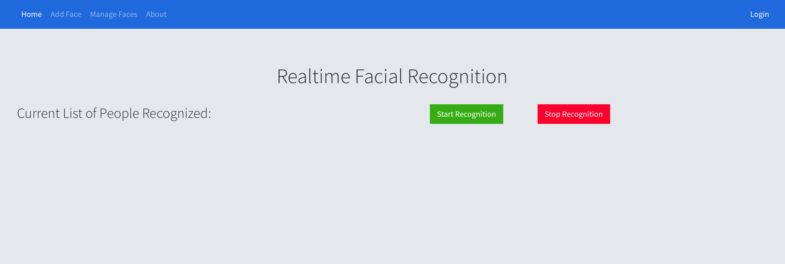

# Facial Recognition

The purpose of this project is to provide a proof of concept for using facial recognition. Some use cases include automatically taking class attendance. The project is built by doing face detection locally in the browser. It sends the detected faces to the backend which calls the AWS Rekognition service to perform the face recognition and sends the response back to the user. The client is browser based and works in all major browsers as well as mobile.




## Getting Started

These instructions will get you a copy of the project up and running on your local machine for development purposes.

### Prerequisites

* Need to have python3 and pip3 installed.
* AWS Credentials with access to the AWS Rekognition APIs
    * Follow instructions at [AWS Rekognition CLI Setup](https://docs.aws.amazon.com/rekognition/latest/dg/setup-awscli-sdk.html) and complete up to step 2
* If not already created, create an AWS Rekogniton collection 
    * Follow instructions at [AWS Rekogniton Create Collection](https://docs.aws.amazon.com/rekognition/latest/dg/create-collection-procedure.html)

### Installing

After completing prerequisites, clone repository.

```
git clone https://github.com/IllinoisTechServicesSRTILab/facial-recognition.git
```

Navigate to the project directory and install python packages.

```
cd facial-recognition
pip3 install -r requirements.txt
```

* Export the aws region as an environment variable or change it in application.py. The default is us-west-2.
* Export the collection id as an environment variable or change it in application.py
* By default only one admin user exists. Export the admin_pass as an environment variable or change it in application.py
* Export the application secret key as an environment variable or change it in application.py.

```
export FACIAL_RECOGNITION_AWS_REGION="AWS REGION"
export FACIAL_RECOGNITION_COLLECTION_ID="YOUR COLLECTION ID"
export FACIAL_RECOGNITION_ADMIN_PASS="YOUR ADMIN PASS"
export FLASK_APP_SECRET_KEY="RANDOM SECRET KEY FOR FLASK"
```

Run Application and open it in the browser.

```
python3 application.py
```

## Deployment

If not accessing from the local machine the website needs to be accessed using HTTPS or the browser will not let the page have access to the webcam. Need to change code to support multiple users instead of only one admin user. Can be deployed using AWS Elastic Beanstalk or manually on any server by following [Moving Flask To Production](https://flask.palletsprojects.com/en/1.1.x/tutorial/deploy/). To easily access the server using https use [Ngrok](https://ngrok.com).

## Built With

* [PicoJs](https://github.com/tehnokv/picojs) - Local Browser Face Detection
* [AWS Rekognition](https://aws.amazon.com/rekognition/) - Face Recognition
* [Flask](https://flask.palletsprojects.com/en/1.1.x/) - Back End Framework
* [Bootstrap](https://getbootstrap.com) - Front End Framework

## Authors

* Abhinav Tekulapally
